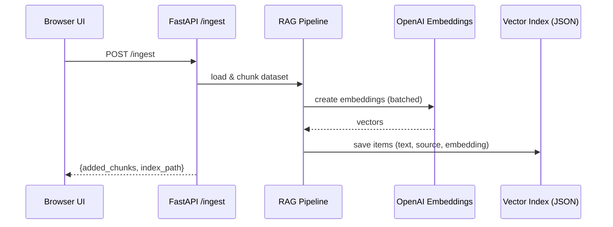
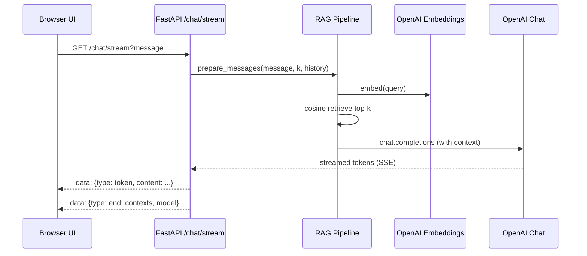
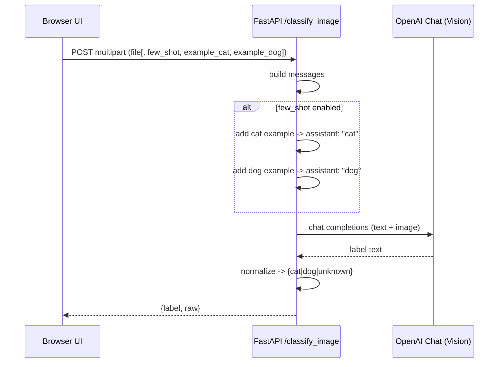

# Imaging RAG + Image Classifier — Architecture

This document outlines the high-level components and request flows for the demo.

Pre-rendered images (SVG):

- Overview: architecture_overview.svg
- RAG Ingest: rag_ingest.svg
- RAG Query (Streaming): rag_query_stream.svg
- Image Classifier: image_classifier.svg

## Components

```mermaid
flowchart LR
  subgraph Browser[Browser UI]
    UI[(Static HTML/JS)]
  end

  subgraph Server[FastAPI Server]
    API1[/POST /ingest/]
    API2[/POST /chat/ & GET /chat/stream/]
    API3[/POST /classify_image/]
    RAG[RAG Pipeline: chunk, embed, retrieve, prompt]
    VS[(JSON Vector Index: data/index.json)]
  end

  subgraph OpenAI[OpenAI APIs]
    E[Embeddings]
    C[Chat (Text + Vision)]
  end

  UI -->|Build Index| API1
  UI -->|Ask (Stream)| API2
  UI -->|Upload Image| API3

  API1 --> RAG
  API2 --> RAG
  RAG <--> VS
  RAG -->|embed/query| E
  RAG -->|answer| C
  API3 -->|vision classify| C
```

## RAG — Ingestion Flow



## RAG — Query Flow (Streaming)



## Image Classifier — Basic and Few‑Shot



## Notes

- Vector store is a simple JSON file, suitable for small demos. Swap with FAISS/Chroma/pgvector for scale.
- Sessions are in-memory; use Redis or DB for multi-instance deployments.
- Models default to `gpt-4o-mini` (chat/vision) and `text-embedding-3-small` (embeddings).
